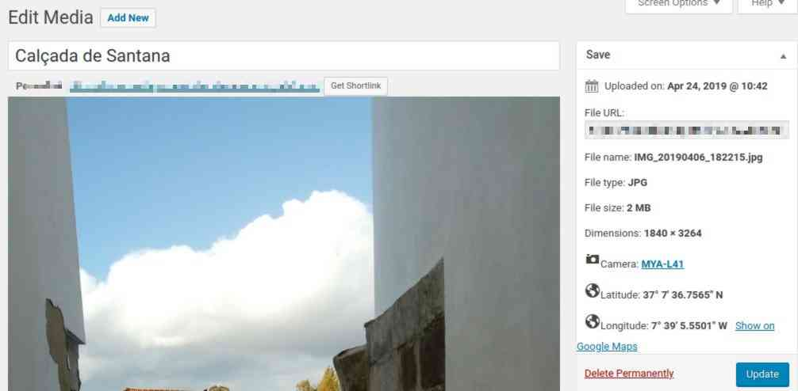
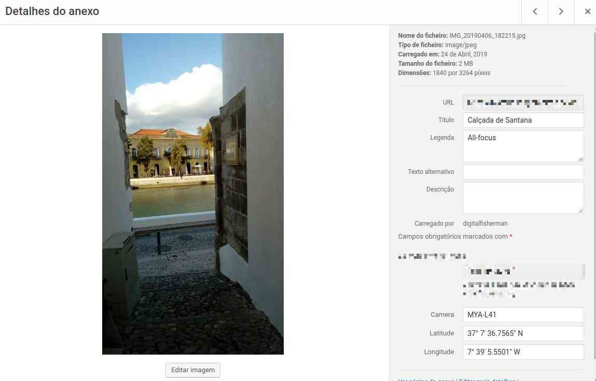
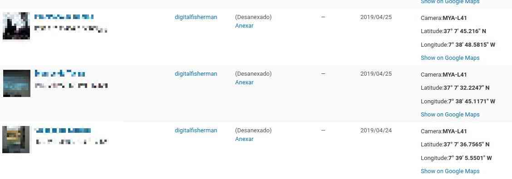
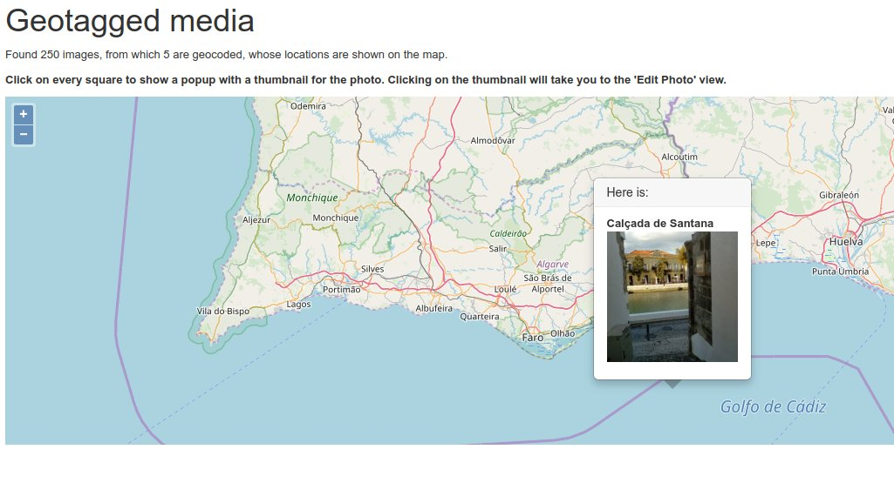
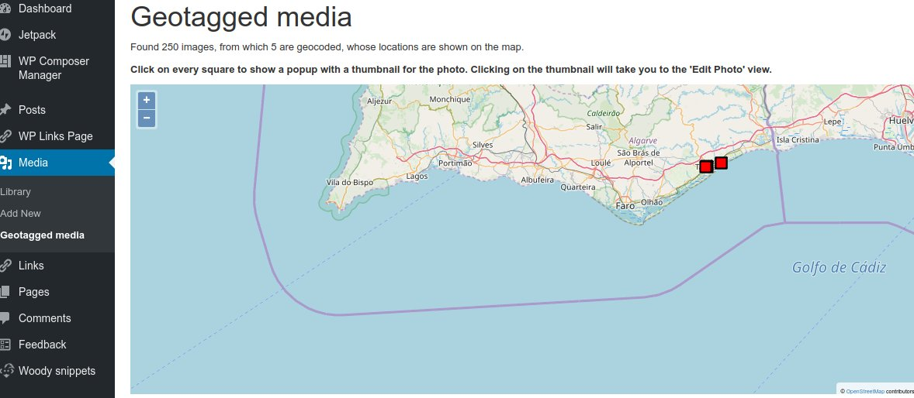

#Geotagged Media
- Contributors: digitalfisherman
- Donate link: https://digfish.org/
- Tags: maps osm openlayers geotag exif dashboard
- Requires at least: 5.0
- Tested up to: 5.1.1
- Stable tag: trunk
- Requires PHP: 5.2.4
- License: GPLv2 or later
- License URI: https://www.gnu.org/licenses/gpl-2.0.html

**Geotagged Media shows the location of your photos in a map on the Dashboard.**

#### Description

This sinple plugin allows to show the location of your photos on map, if they were geotagged (i.e., they contain an EXIF tag with the geocoordinates).
It uses the [OpenLayers JS Library](https://openlayers.org/) to render the points in a [OpenStreetMap](https://www.openstreetmap.org/). Clicking on the points will show a popup with a thumbnail. Clicking in it will open the 'Edit Image' for that particular photo
Besides the map, it adds a 'metadata' column to the Media Listing table with the coordinates and the camera which took the photo. In the 'Edit Media' and 'Attachment Details' views adds fields with the coordinates and camera metadata values.

#### Installation

1. Upload the plugin files to the `/wp-content/plugins/geotagged-media` directory, or install the plugin through the WordPress plugins screen directly.
2. Activate the plugin through the 'Plugins' screen in WordPress
3. A new entry in the sidebard menu called 'Geotagged media' will apear. By now, this plugin is not configurable.

#### Frequently Asked Questions 

_My photos from my camera are surely geotagged, why they don't appear as such in Wordpress ?_

- Perhaps your photos were resized or edited with another tool. Some media editors remove the EXIF tags, and so they appear to not have any geodata in it. Copy or upload your photos directly from your camera device without any alterations or at least use a media editor that retains the EXIF tags.

#### Screenshots

#### Changelog 

##### 0.0.1
- First version

##### 0.1
- First release

#### Upgrade Notice

##### 0.1
First version. Not applicable.

